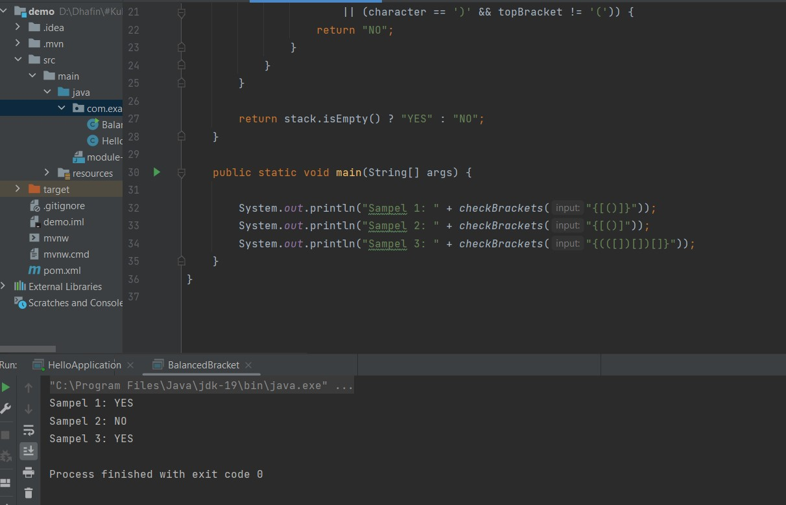

# test_Gits (Jawaban Soal)
Jawaban/output untuk soal pertama : 

Jawaban/output untuk soal kedua : 

Jawaban/output untuk soal ketiga : 
- dengan hanya membuat satu fungsi utama yang melacak braket buka terlebih dahulu, jika braket buka cocok maka push ke stack tetapi jika tidak cocok hasilnya 'NO' dan jika empty maka hasilnya juga 'NO'. lalu yang terakhir maka diperiksa langsung dengan karakter yang sesua jika tidak sesua/cocok maka hasilnya 'NO'.
- Dalam loop, hanya memeriksa karakter yang sesuai dengan braket buka dan braket tutup " '{'  '}', '['  ']', '('  ')' " .

